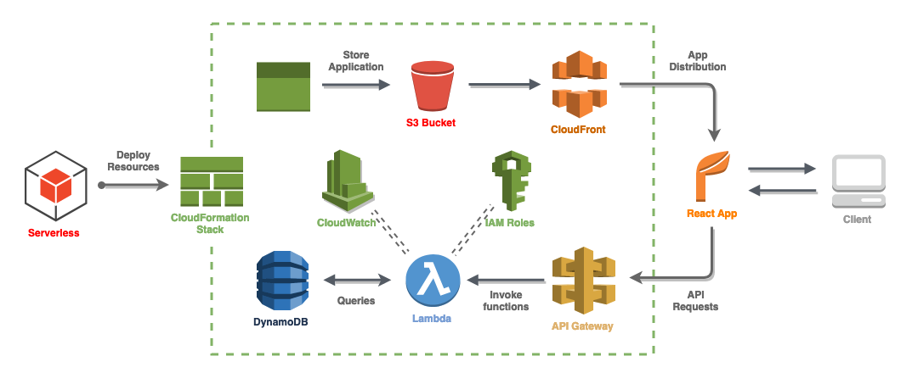

Serverless Equipment API
=================================
Set of tools and applications to demonstrate rapid development of serverless IoT projects. Provisions and scales automatically to cloud. Can be easily exported into CI/CD pipeline.

**Solution Overview:** [Solution Diagram](https://s3-eu-west-1.amazonaws.com/arttu-serverless-equipment-app/Serverless-API.png)



**API Documentation:** [https://d2tbrnc2i93irp.cloudfront.net/api](https://d2tbrnc2i93irp.cloudfront.net/api)

**Demo Application:** [https://d2tbrnc2i93irp.cloudfront.net/app](https://d2tbrnc2i93irp.cloudfront.net/app)

### Features
* Fetch Equipment by EquipmentNumber
    * Implemented by using DynamoDB hash key based load. Query is another way to go and would be the choice if we would
    example like to condition the results with range. 
* Fetch List of Equipment with pagination
    * Implemented by using DynamoDB Scan with limit and exclusiveStartKey. 
    For this demo a custom iterator was used for scan since DynamoDB scan limit is not really 
    limiting the results. Scan returns a PaginatedList, which lazily loads more results 
    from DynamoDB as necessary. Better solution for limiting and pagination results would using queries
    with sort keys.
* Create Equipment Item
    * Implemented by using DynamoDB save that maps directly to class properties. 
    DynamoDB save expression can be defined to prevent saving of duplicate items based on hash key automatically so that 
    there is no need to make custom validation implementation.


Instructions
=================================
### Pre-Requisites
* [AWS CLI configured](https://docs.aws.amazon.com/cli/latest/userguide/cli-chap-configure.html) for local development
* [Node](https://nodejs.org/en/download/)  for running serverless
* [Serverless framework](https://serverless.com/). Powerful toolkit for developing serverless web applications in "infrastructure as code" manner.
* JDK version 8.x or newer
* [Maven](https://maven.apache.org/) for building the Java app
* [Docker]() for local development
* [React]() for client app
* [Swagger]() for API Documentation (generated with AWS API Gateway)

### Installed Plugins for serverless
* [serverless-plugin-stage-variables]() For enabling Cloudwatch logging automatically
* [serverless-sam]() for generating SAM templates from serverless template
* [serverless-finch]() for deploying client app to s3

### How to deploy to cloud
Since serverless framework generates SAM based on the implementations of Handler and Response interfaces we can provision
needed resources automatically:
```
mvn clean install && sls deploy
```

Additional needed resources such as dynamodb, s3 buckets and IAM roles are defined in serverless.yml

Serverless Framework allows you to create stages for your project to deploy to. Stages are useful for creating environments for testing and development.
You can specify stages in yml template or by deploying with `--stage` flag

### How to develop locally
Instead of deploying to the cloud, you can deploy application locally in docker containers and test lambdas in your local 
environment.

1) Set up docker. In order to make containers link to each other, create dynamodb container using specified network and attach it to SAM with `--docker-network` tag (explained later)

    ```
    docker run --network serverless-equipment-api-local \
    -d -p 8000:8000 --name dynamodb amazon/dynamodb-local
    ```

2) Create table to dynamodb running in the container:
    ```
    aws dynamodb create-table \
      --table-name Equipment  \
      --attribute-definitions \
        AttributeName=EquipmentNumber,AttributeType=S --key-schema \
        AttributeName=EquipmentNumber,KeyType=HASH \
      --provisioned-throughput ReadCapacityUnits=1,WriteCapacityUnits=1 \
      --endpoint-url http://localhost:8000
    ```

3) Populate database with mock data
    ```
    aws dynamodb --region=eu-west-1 --endpoint-url http://localhost:8000 \
    put-item --table-name Equipment --item \
    '{"EquipmentNumber": {"S": "D435"}, "Address": {"S": "Test"},"ContractStartDate":{"S": "2010-05-30 22:15:51"},"ContractEndDate": {"S": "2010-05-30 22:15:52"},"Status":{"S":"STOPPED"}}'
    ```

4) You can test single function with serverless invoke:
    ```
    serverless invoke local --function getEquipment --data '{"pathParameters": {"id": "1"}}'`
    ```
5) You can change environment variables such dynamodb endpoint by using `-env` flag

6) Whole application can be emulated locally by using SAM:
    ```
    serverless sam export --output ./template.yml
    ```
    
    ```
    sam local start-api --docker-network serverless-equipment-api-local
    ```
    
### Running and deploying the client app

1) Run locally:  ```npm run install && npm run start```

2) To build and deploy to cloud: ```npm run build && serverless client deploy```

Build is located in build folder which is used as a source folder for serverless deploy of the client application. After runnng client deploy the static bundles are uploaded to S3 bucket which is used as origin of AWS CloudFront distribution.


### Deploying with AWS CodePipeline
Use ```buildspec.yml``` to make automated builds in AWS CodeBuild. Use CodePipeline to build a CI&CD pipeline from the repository source and cloudformation stack from build output.


## License
This project is licensed under the MIT license, Copyright (c) 2019 Arttu Pekkarinen. For more information see `LICENSE.md`